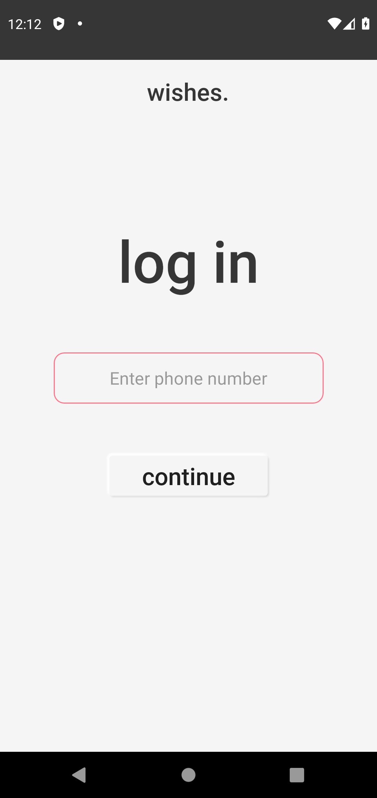
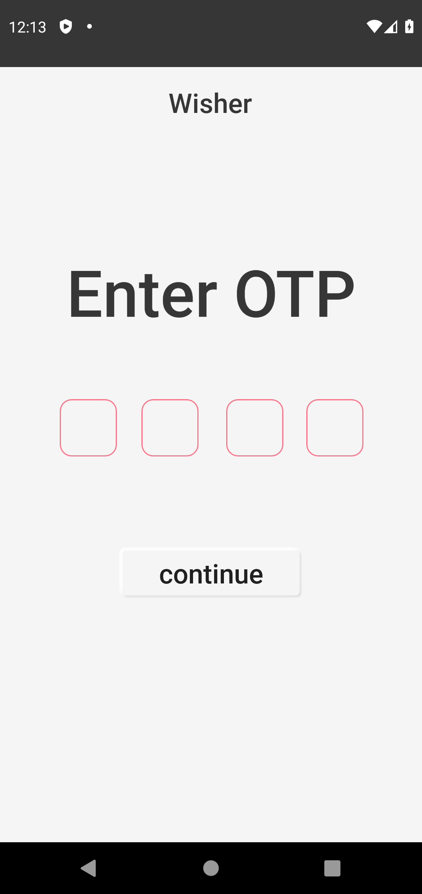
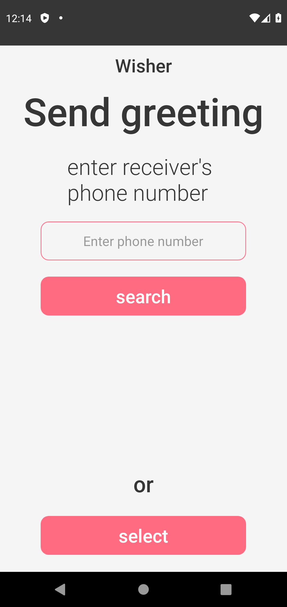
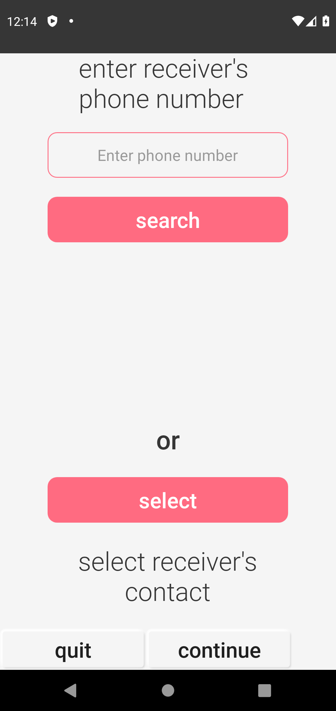
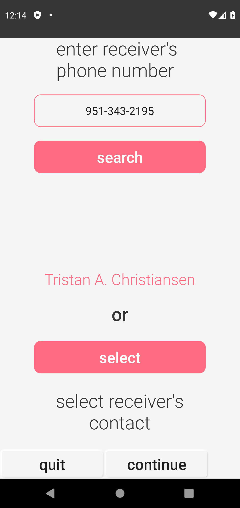
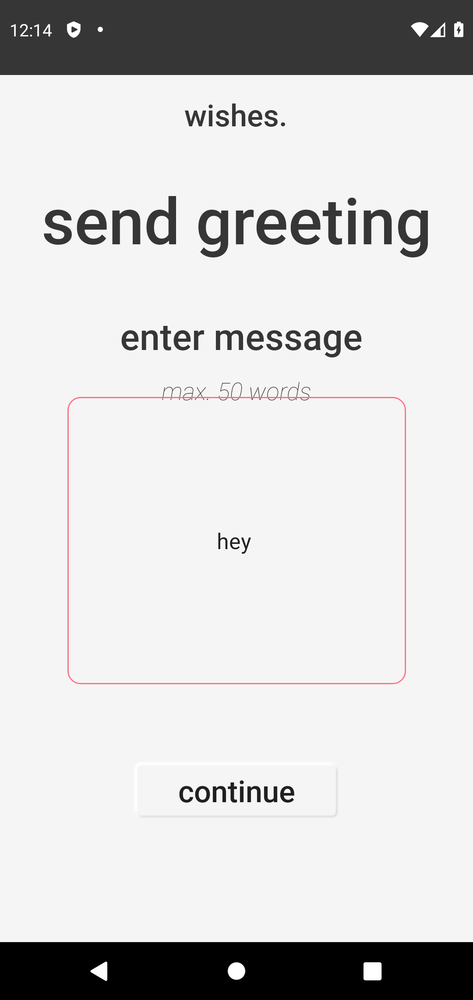
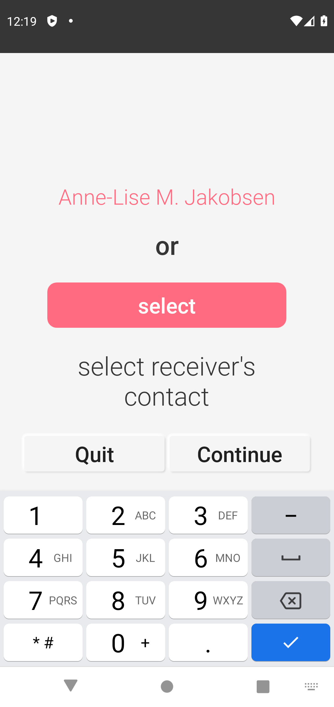

# Sms-Greeter
### Exercise 9
A simple app to demonstrate sms-manager implementation in android
Feel free to fork clone,or create a pull request
 <table>

   <tr>
         <td></td>
         <td></td>
         <td></td>
   </tr>
   <tr>
         <td></td>
         <td></td>
         <td></td>
   </tr>
   <tr>
         <td></td>
         <td></td>
         <td></td>
   </tr>
 </table>
